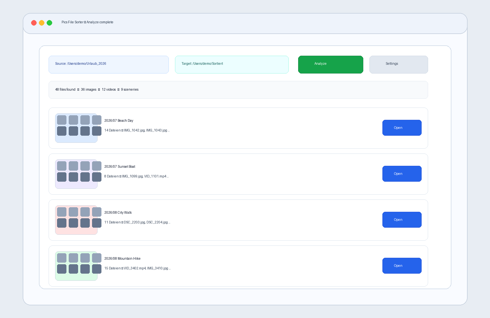
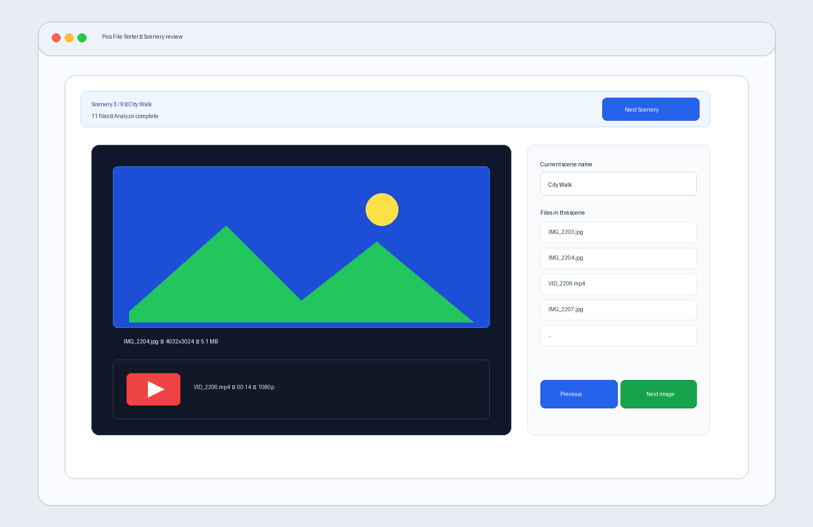

# Pics File Sorter

Pics File Sorter is a local web app that helps you sort photo and video files from a source folder into a clean target folder structure.

## What this project does

The app guides you through four steps:

1. Select source and target folders (via the browser File System Access API)
2. Recursively scan media files in the source folder
3. Group recordings into "scenes" and name them
4. Copy files into a `Year/Month/Scene` structure

## Screenshots (simulated example media)

### Analyze overview (images + videos detected)



### Scenery review after Analyze



## Key features

- Supports images, videos, and RAW files
- Batch grouping by time gap (1 minute, 10 minutes, 1 day, or custom)
- Customizable filename token syntax to extract date/time from filenames
- Fallback to filesystem timestamps if no date can be extracted from a filename
- Multilingual UI (German, English, Italian, French, Spanish)
- Theme selection (System, Light, Dark)
- Local settings persistence in the browser

## Supported browsers

The app requires the **File System Access API**. In practice, this means:

- Chrome
- Edge
- Opera

## Installation

```bash
npm install
```

## Start development

```bash
npm run dev
```

## Build

```bash
npm run build
```

## Run tests

```bash
npm run test
```

## Tech stack

- React 18
- TypeScript
- Vite
- Vitest

## Notes

- The app runs locally in the browser and works only with user-selected directories.
- There is no backend in this repository.
